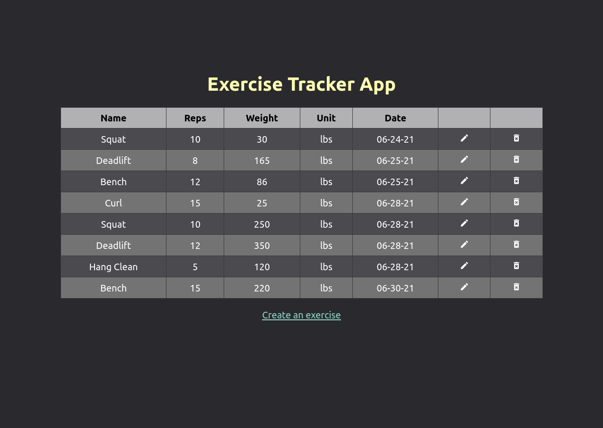

# Exercise Tracker App

A simple web app using [MongoDB], [Express], [React], and [Node.js] to do CRUD
operations.

- The backend REST API is located in [./exercise-rest](./exercise-rest)
- The frontend user interface is located in [./exercise-ui](./exercise-ui)

[MongoDB]: https://www.mongodb.com/
[Express]: https://expressjs.com/
[React]: https://reactjs.org/
[Node.js]: https://nodejs.org/en/
